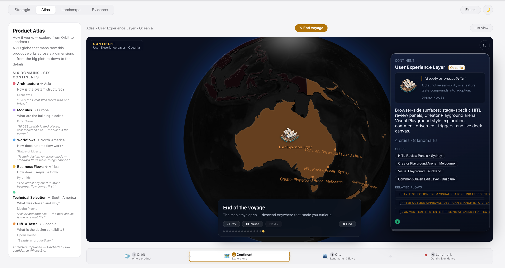
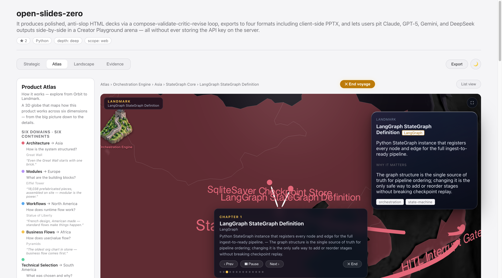
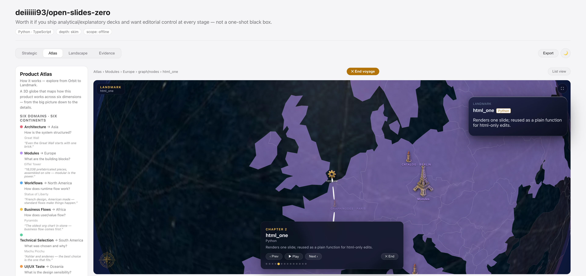
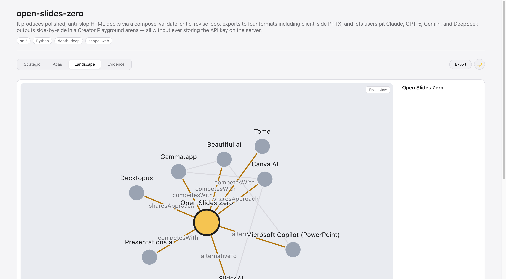

# Grasp — Strategic Repo Understanding for Claude Code

Turn any repository into a **strategic brief**: five answers (idea, problem, why it wins, how it works, similar repos) backed by two interactive graphs — a product atlas and a competitive landscape.

**Product Atlas** — zoom from orbit to continent, explore cities and related flows:



**Voyage** — guided tour through every continent, city and landmark:





**Landscape** — competitive map showing how the repo relates to alternatives:



## Install

```
claude plugin install github:deiiiiii93/grasp-anything
```

## First-time setup

After installing, run the one-time build step (requires Node ≥ 22):

```
/grasp:setup
```

This installs dependencies and builds the dashboard (~30 seconds). Re-run after updating the plugin.

## Usage

```
/grasp                          # analyse the current directory
/grasp /path/to/repo            # analyse a local repo
/grasp https://github.com/...   # analyse a public GitHub repo
```

On first run you'll be asked two questions:

- **Depth** — `docs` (README/docs only) · `skim` (+ entry points, recommended) · `deep` (full implementation trace)
- **Broadness** — `offline` (repo only) · `web` (+ search for adoption & alternatives, recommended)

Grasp spins up a local HTTP server and opens the report in your browser. The URL (e.g. `http://localhost:8787`) is printed so you can reload or share it across tabs.

## Incremental re-runs

Grasp tracks which parts of the brief are stale. Re-running `/grasp` on the same repo only recomputes what changed.

| Flag | Effect |
|------|--------|
| `--full` | Recompute everything |
| `--refresh-landscape` | Refresh the competitive landscape |

## Export

Share the brief outside the dashboard:

```
/grasp        # after the report opens, use the Export menu in the UI
```

Exports to `report.md` (Mermaid graphs) and `report.html` (self-contained print page).

## Requirements

- Claude Code
- Node.js ≥ 22
