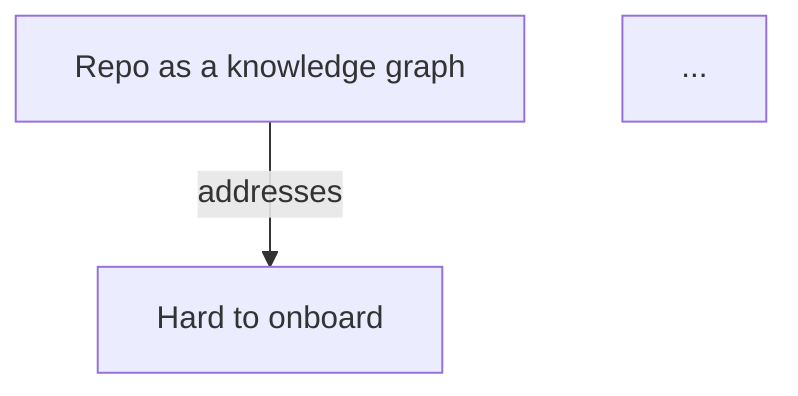
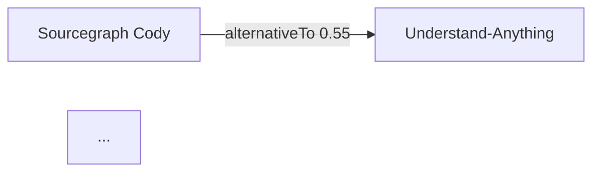

# `/grasp` Export (Markdown + print-ready HTML→PDF) — Design

**Date:** 2026-06-08
**Status:** Approved (brainstorming), pending implementation plan
**Builds on:** the completed `/grasp` v1 (`docs/superpowers/specs/2026-06-08-grasp-design.md`)

---

## 1. Summary

Add a **share/export** capability to `/grasp`: turn a validated `repo-brief.json`
into two portable artifacts —

1. **Markdown** (`report.md`) — the five answers + evidence footnotes + the two
   graphs as **Mermaid** diagrams (GitHub/GitLab/VS Code render them inline).
2. **Print-ready HTML** (`report.html`) — one **self-contained** light-theme page
   (prose + evidence + both graphs as **inline static SVG**, no JS, no external
   assets) designed to be printed to **PDF** (Cmd-P, or a headless browser).

This was a v1 non-goal (spec §2); it is now an additive sub-project. It changes
nothing about how briefs are produced — it is a pure presentation layer
*downstream* of a finished `repo-brief.json`.

**Decisions locked during brainstorming:**
- PDF is produced via **print-ready HTML**, not a PDF library (keeps the project's
  no-build / dependency-light ethos; graphs stay crisp vector SVG).
- Markdown renders the graphs as **Mermaid** diagrams.
- The print-HTML reuses the dashboard's existing layout math (DRY + the printed
  graph matches the on-screen graph).

---

## 2. Goals & Non-Goals

### Goals
- One command turns a brief into a `.md` and/or a print-ready `.html`.
- Both are **deterministic, pure transforms** of `BriefDoc` — golden-testable, no
  external processes, no new runtime dependency.
- Markdown is self-contained and paste-ready (README/PR); HTML prints to a clean PDF.
- Reuse the existing contract (`@grasp/schema`) and layout (`@grasp/dashboard`
  adapters) — no duplicated truth.

### Non-Goals
- Emitting `.pdf` bytes directly from the tool (the HTML is the PDF source; an
  optional headless-print convenience is documented, not required).
- A configurable theming/templating system (one good light print theme).
- DOCX / other formats.

---

## 3. Architecture

A new workspace **`packages/export`** (`@grasp/export`), depending on:
- `@grasp/schema` — `BriefDoc`, `validateBrief`, evidence/graph types.
- `@grasp/dashboard` — the **pure** layout adapters `layoutConcept` /
  `layoutLandscape` (and their VM types), reused for the print SVG. These are
  exported additively via a new `@grasp/dashboard/adapters` subpath that pulls in
  **no React** (the adapter modules import only `@grasp/schema` types).

```
packages/export/                 # NEW
└── src/
    ├── index.ts                  # public exports
    ├── mermaid.ts                # conceptToMermaid(doc), landscapeToMermaid(doc)  → Markdown
    ├── svg.ts                    # conceptToSvg(doc), landscapeToSvg(doc)          → print-HTML
    ├── markdown.ts               # briefToMarkdown(doc): string
    ├── printHtml.ts              # briefToPrintHtml(doc): string
    ├── cli-run.ts                # runExport(argv): number   (testable)
    └── cli.ts                    # #!/usr/bin/env tsx bin wrapper

packages/dashboard/
├── package.json                  # MODIFY — add "./adapters" export subpath
└── src/adapters/index.ts         # NEW — re-export layoutConcept/layoutLandscape (+ VM types, resolveEvidence/EvidenceChip)

skills/grasp/SKILL.md             # MODIFY — add an "Export & share" step
```

**Why a separate package** (not `packages/pipeline`): export is a distinct concern
(presentation/sharing) and is conceptually *downstream* of a finished brief, not
part of producing one. Putting it in `pipeline` would couple the brief-production
pipeline to the dashboard's layout. A focused package keeps each unit's
responsibility clear. *(Alternative considered: a fully standalone `@grasp/export`
with its own ~15-line radial layout — rejected to avoid a second source of layout
truth and keep the printed graph consistent with the screen.)*

Load-bearing principle, unchanged: **deterministic code renders; `repo-brief.json`
is the contract.** The exporters read only a validated `BriefDoc`.

---

## 4. Markdown exporter — `briefToMarkdown(doc): string`

A pure transform producing one Markdown document:

```
# <repo>

> <takeaway verdict>

`★ <stars> stars · <language> · <depth> × <broadness>`   ← signals line (omits absent fields)

## Idea
<brief.idea> [^e1]

## Problem
<brief.problem>

## Why it wins
<brief.why> [^e2]

## How
<brief.how>

## Takeaway
<brief.takeaway>

## Concept map


## Competitive landscape


[^e1]: Ships an interactive web dashboard — README (verified)
[^e2]: 1,200+ GitHub stars — GitHub (verified)
```

- **Evidence → footnotes.** `brief.evidence` (per-prose) drives `[^id]` markers on
  the relevant sections; the footnote text is `claim — source (verified|inferred)`,
  with a link when `evidence[].url` is present. Every cited evidence id gets one
  footnote definition; uncited evidence is omitted.
- **Mermaid concept graph.** Nodes become Mermaid nodes with a `:::type` class
  (idea/problem/mechanism/outcome/feature) and a `classDef` block for colors;
  edges become `A -->|<edgeType>| B`. Labels are escaped (quotes/newlines).
- **Mermaid landscape graph.** `self`/`alternative`/`category` nodes; alternative
  edges carry `|<edgeType> <similarity>|`; alternative labels link out via a
  `click <id> "<url>"` directive where a URL exists.
- **Determinism:** node/edge order follows `BriefDoc` array order; no timestamps in
  the body (so the same brief always yields the same Markdown).

`mermaid.ts` holds `conceptToMermaid(doc)` and `landscapeToMermaid(doc)` (pure
string builders, no layout needed — Mermaid self-lays-out). `markdown.ts`
assembles prose + footnotes + the two blocks.

---

## 5. Print-HTML exporter — `briefToPrintHtml(doc): string`

One **self-contained** HTML string (everything inlined — no `<script>`, no external
`href`/`src`):

- `<style>` with a light print theme, `@page { margin: 18mm }`, and
  `@media print` rules; page-break-avoidance around each section and each graph.
- **Header:** repo name (linked to `meta.url`), the takeaway verdict, signal chips.
- **Five prose sections** with evidence as superscript reference markers, plus a
  **References** list at the end (`[1] claim — source (verified|inferred)`,
  unverified visually marked).
- **Both graphs as inline static SVG.** `svg.ts` consumes the dashboard's
  `layoutConcept(doc)` / `layoutLandscape(doc)` output (nodes with `x`/`y`/`type`/
  `label`/resolved `evidence`, edges, viewBox) and serializes a static `<svg>`:
  `<line>` per edge, a `<g><circle/><text/></g>` per node, type-colored for print.
  No interactivity, no JS — so it prints identically headless or via Cmd-P.

PDF is produced by **printing this HTML**: the user opens it and Cmd-P → "Save as
PDF", or the SKILL runs a headless print when a browser is available (see §6). The
deterministic deliverable of the tool is the HTML; the PDF is the print of it.

---

## 6. CLI + SKILL wiring

### CLI — `grasp-export`
`cli-run.ts` exports `runExport(argv): number`; `cli.ts` is the `#!/usr/bin/env tsx`
bin (mirrors `grasp-assemble`/`grasp-state`).

```
grasp-export <brief.json> --format md|html|both --out <dir>
```
- Reads + `validateBrief`s the input (exit 1 on invalid, with prefixed errors).
- Writes `report.md` and/or `report.html` into `<out>`; prints each written path to
  stdout.
- Exit codes: 0 ok · 1 invalid brief · 2 usage/IO error. `--format` defaults to
  `both`; `--out` defaults to the brief file's directory.
- Registered as the `grasp-export` bin in `packages/export/package.json`.

### SKILL.md — "Export & share" (after Phase 4)
A short section: to share the brief, run
`npx tsx packages/export/src/cli.ts <target>/.grasp/dashboard/repo-brief.json --format both --out <target>/.grasp`,
then open `report.html` and print to PDF — or, when a headless Chrome is available,
`chrome --headless --print-to-pdf="<target>/.grasp/report.pdf" "<target>/.grasp/report.html"`.
Markdown (`report.md`) is paste-ready for a README/PR. (Drift-guard test asserts the
SKILL references `grasp-export` and `report.html`.)

---

## 7. Error Handling

| Situation | Behavior |
|---|---|
| Brief file missing / unparseable | Exit 2, clear message. |
| Brief invalid against schema | Exit 1, prefixed validator errors (reuse `validateBrief`). |
| `--out` dir unwritable | Exit 2, clear message. |
| Graph empty (e.g. offline self-only landscape) | Render what exists — a self-only landscape is a single node; concept always has ≥ the idea node. |
| Evidence id referenced but absent | Cannot happen — `validateBrief` already guarantees referential integrity before export. |

---

## 8. Testing

The golden `packages/schema/sample-brief.json` is the shared fixture again.

- **Markdown** (`markdown.test.ts`): assert the document contains each of the five
  section headings, a `[^...]` footnote for cited evidence with `(verified)` /
  `(inferred)` text, and two fenced ` ```mermaid ` blocks; assert determinism (same
  input → identical output).
- **Mermaid** (`mermaid.test.ts`): `conceptToMermaid` emits exactly one node line per
  concept node and one edge line per edge with the right relation label; landscape
  emits a `click` directive for alternatives with URLs; labels with quotes are escaped.
- **SVG** (`svg.test.ts`): `conceptToSvg`/`landscapeToSvg` produce a `<svg>` whose
  `<g>`/`<text>` count matches the node count and `<line>` count matches edges;
  coordinates are finite; output is deterministic.
- **Print-HTML** (`printHtml.test.ts`): contains all five answers, two `<svg>`
  blocks, an evidence/References section, an `@media print` rule, and is
  **self-contained** — no `<script>`, no `src=`/`href="http`.
- **CLI** (`cli.test.ts`): run `runExport` against the golden brief into a temp dir →
  exit 0, both files written and non-empty; `--format md` writes only `.md`; an
  invalid brief → exit 1; missing args → exit 2.

The golden double-duty (fixture + real export data) means the exporters can be built
and verified entirely against the committed contract, with no pipeline run needed.

---

## 9. Build Sequence (suggested)

1. `packages/export` scaffold + the additive `@grasp/dashboard/adapters` export.
2. `mermaid.ts` (+ tests).
3. `markdown.ts` (+ golden tests).
4. `svg.ts` (+ tests).
5. `printHtml.ts` (+ tests).
6. `grasp-export` CLI (+ integration tests).
7. SKILL.md "Export & share" + drift-guard test.

One plan, ~7 tasks. No changes to `@grasp/schema`, `@grasp/pipeline`, or the
dashboard's runtime behavior (only the additive adapters export).
